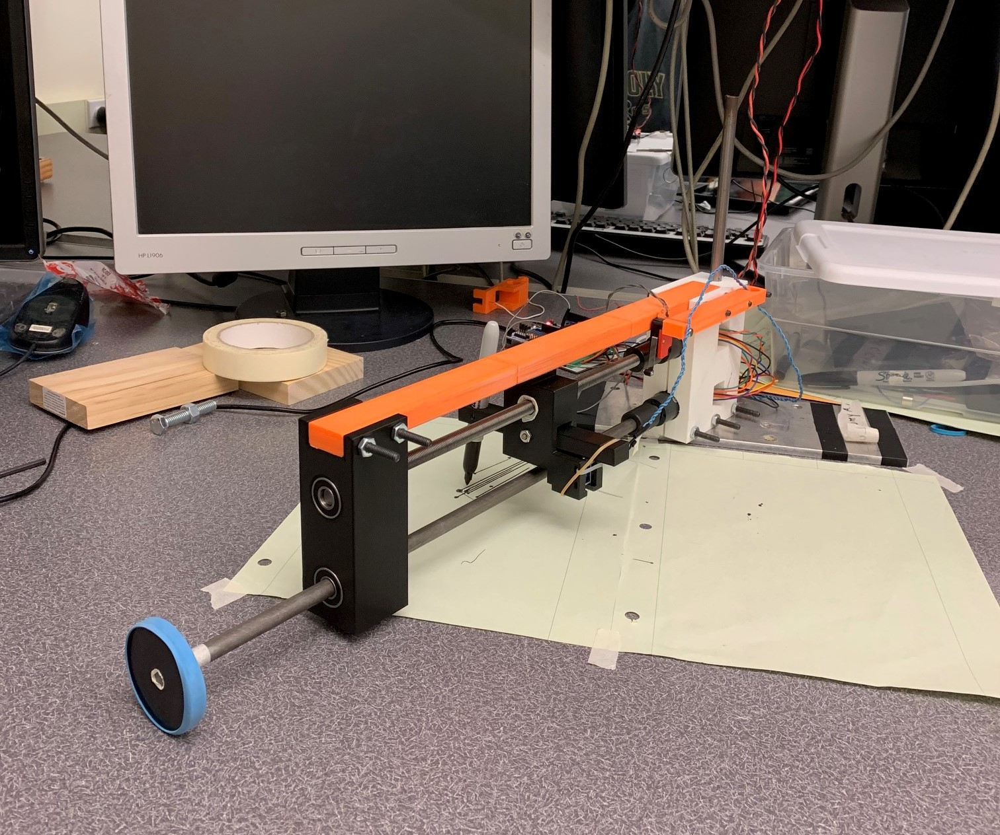
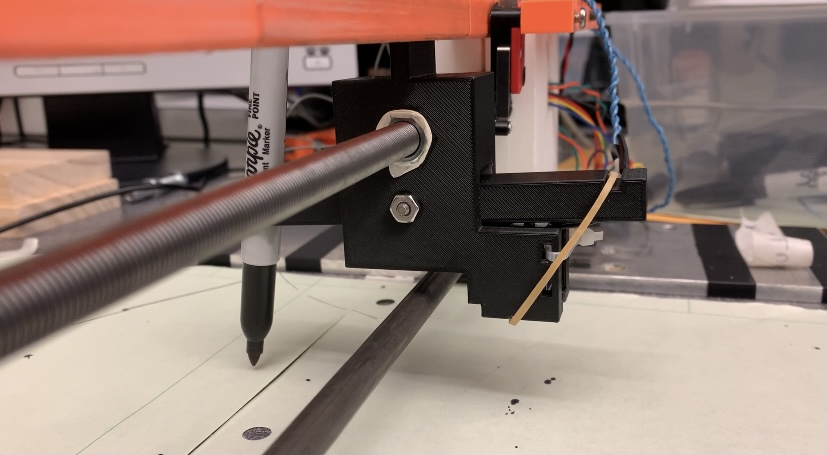
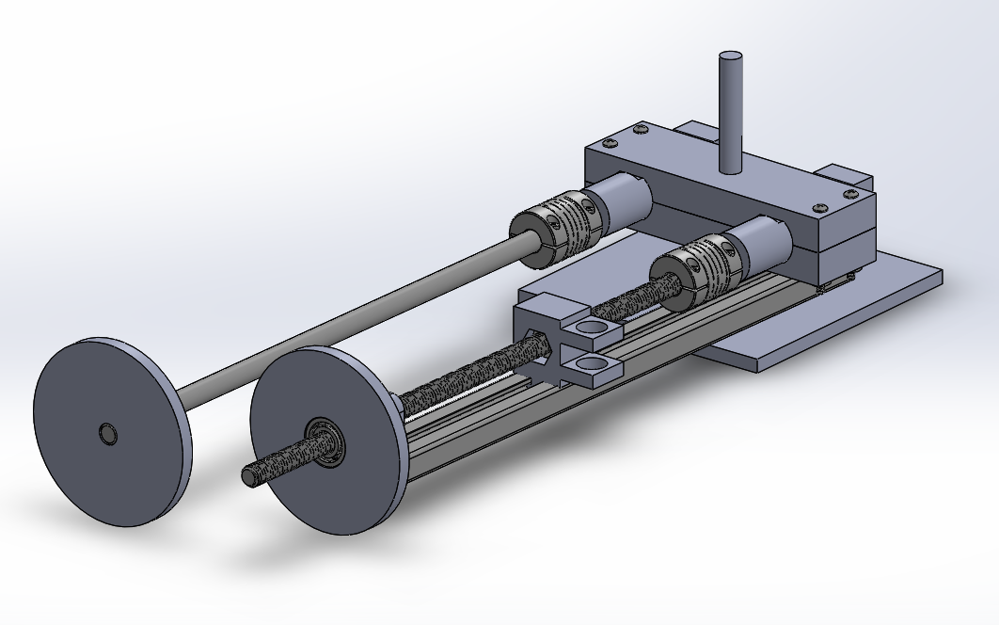
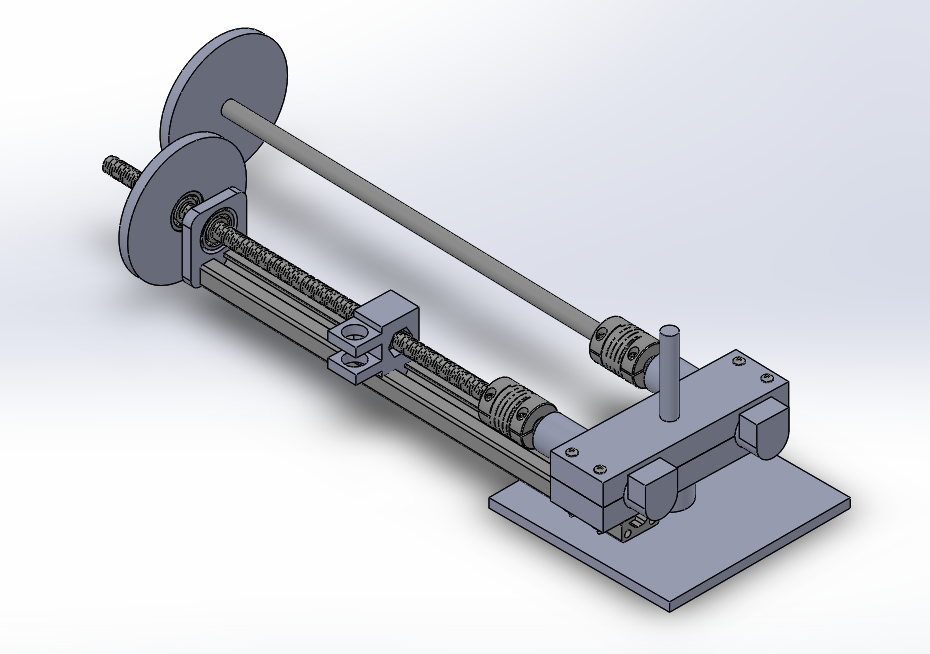

# PlotSomething

Figure 1. System Overview

## Introduction

Our device is a pen plotter system that automatically plots an image through the use of an hpgl file. Through user interface, the 
user presses p’ to plot, ‘q’ to quit, and ‘h’ to return to the welcome screen. After pressing ‘p’, the user is prompted to enter 
a hpgl filename. Once that is completed, the device will start to read the hpgl file and plot as the program reads each coordinate. 
If this filename doesn’t exist in the folder, it will prompt a message that says, “invalid file name”. This device is meant for people 
who are able to convert their desired image into an hpgl file and for those who want to plot something on paper without having to draw 
it themselves. This device is also for people who don’t want a typical, boring printed image on a piece of paper.

## Hardware Overview

The following table displays all of our hardware components used in this project. Fasteners such as screws, bolts, and nuts are not listed.

| Part No.  | Part                              |  Qty. | Source            |
|:---------:|:---------------------------------:|:------|:-----------------:|
|    1      | 2-in Drive Wheel                  |   1   | 3-D Printed       |
|    2      | Track Slider/Solenoid Carrier     |   1   | 3-D Printed       |
|    3      | Lever Arm/Pen Carrier             |   1   | 3-D Printed       |
|    4      | Motor Mount                       |   1   | 3-D Printed       |
|    5      | T-Slot Framing Rail               |   1   | 3-D Printed       | 
|    6      | Drive Shaft and Lead Screw Mount  |   1   | 3-D Printed       |
|    7      | Limit Switch Mount                |   1   | 3-D Printed       | 
|    8      | Metal Base Plate                  |   1   | ME405 Lab         |
|    9      | Base Shaft                        |   1   | ME405 Lab         |
|    9      | 3/8 in Drive Shaft                |   1   | Home Depot        |
|    10     | 3/8 in-24 Threaded Rod            |   1   | McMasterCarr      |
|    11     | 3/8 in-24 Hex Nut                 |   1   | Home Depot        |
|    12     | DC Voltage Limit Switch           |   1   | Amazon            |
|    13     | Solenoid (5V, 1.1A)               |   1   | Amazon            |
|    14     | Roller Bearing                    |   5   | Amazon            |
|    15     | Set Screw Shaft Coupling          |   2   | McMasterCarr      |
|    16     | Black FinePoint Sharpie&trade;    |   1   | Campus Bookstore  |
|    17     | Rubber Band                       |   2   | Home              |
|    18     | Nucleo with Shoe	                |   1   | ME405 Tub         |
|    19     | Mini Breadboard	                |   1   | ME405 Tub         |
|    20     | MOSFET	                        |   1   | IEEE Campus Store |
|    21     | 1N4004 Diode	                |   1   | ME405 Tub         |
|    22     | 5 Ohm Resistor                    |   1   | ME405 Lab         |

Our pen plotter project uses a cylindrical axis system that has one axis of rotation at the base shaft:
- one drive shaft that rotates using torque from one motor connected to a drive wheel.
- one lead screw that moves the pen radially using torque from one motor.

The vertical base shaft rotates about the center of axis of rotation by being press-fit into a roller bearing, 
which was press-fitted into a metal plate that sits on the tabletop.

We 3-D printed a mount to keep both motors stationed close to the base shaft. The two motors are connected 
to a drive shaft and a lead screw using set screw shaft couplings. Since the motors don’t have enough torque 
to drive the entire system, we created a larger torque by incorporating a drive wheel. This drive wheel was 
3-D printed, and a rubber band was wrapped around the diameter of the wheel to provide friction when it contacts 
the table. The drive wheel was press-fit into the drive shaft, and masking tape was used to create a tighter fit. 

As the lead screw nut undergoes translation motion, we ensured that the lead screw did not rotate by incorporating a 
slider mechanism. Using a 3-D printed part that acts as a T-Slot framing rail, we 3-D printed a track slider to fit 
within the slot clearance. We designed this track slider to have the lead screw nut press fitted inside, so as the lead 
screw rotates, the slider prevents any rotation around the lead screw. We used white masking tape to ensure a tighter 
press-fit. See figure 2 below for reference.

Figure 2. Close-Up Shot of Track Slider and Lever Arm

## Software Overview

Figure 1. Isometric Front View

Figure 2. Isometric Back View